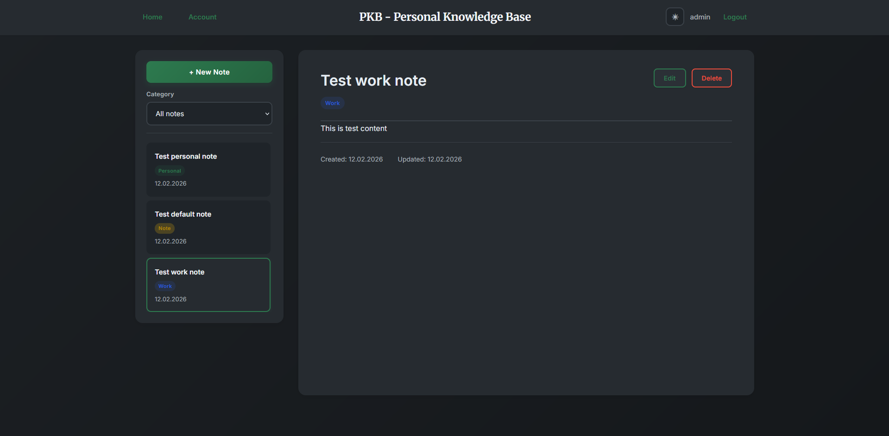

# PKB — Personal Knowledge Base

PKB — это веб-приложение для хранения и организации личных знаний:
заметок, ссылок и идей.



## Основные возможности
- Рабочий API (базово) [✓]
- Регистрация и аутентификация пользователей [✓]
- Рабочий фронт [?]
- Создание и редактирование заметок [?]
- Первая база тестов на Java [?]
- Категории и теги [?]
- Поиск по заметкам [?]
- Архивация и избранное [?]

## Технологии
- Java 17
- Spring Boot 3
- Spring Security
- Spring Data JPA
- PostgreSQL
- HTML + CSS

# Запуск

## Требуется иметь
- **Java 17+**
- **Gradle**
- **Docker(для поднятия PostgreSQL базы)**
- **Любая IDE**

## Подготовка БД

1. Поднять Docker контейнер с PostgreSQL:

```bash
   docker run \
     --name postgres-database \
     -e POSTGRES_USER=codekitchen \
     -e POSTGRES_PASSWORD=12345678 \
     -e POSTGRES_DB=codekitchen \
     -p 5432:5432 \
     -v postgres-database:/var/lib/postgresql/data \
     postgres:15.3
```

## Запуск приложения

1. Клонировать репозиторий

```bash
git clone https://github.com/depedence/personal-knowledge-base.git
```

2. Открыть проект в IDE

3. Настроить `application.properties`

Файл `application.properties` уже закоммичен и настроен, (дополнительная настройка не требуется)

4. Подождать инициализацию проекта и подтянуть все зависимости в `build.gradle.kts`

5. Запустить `PkbApplication.java` через IDE

## Старт приложения

- Приложение стартует на https://localhost:8080/
- `/` - стартовая страница
- `/login` - страница авторизации
- `/registration` - страница регистрации
- `/account` - профиль

Для первого входа **необходимо зарегистрироваться**
